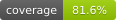

# Measured statement coverage

Source: [aa8b5cefc11e](https://github.com/Yakwilik/go-yamlvalidator/commit/aa8b5cefc11e062f5f9f8efb7e8971e73abf6f0e) · [GitHub Actions run](https://github.com/Yakwilik/go-yamlvalidator/actions/runs/36451932221)

**81.6%** — 4385 of 5371 instrumented statements covered.

Generated from the CI coverage profile, not a manually maintained percentage.
Scope: the library packages and shared internal implementations selected by
<code>scripts/check-library-coverage.sh</code>. This is statement coverage, not line coverage.

| Package | Statement coverage |
| --- | ---: |
| <code>github.com/Yakwilik/go-yamlvalidator</code> | 100.0% (26/26) |
| <code>github.com/Yakwilik/go-yamlvalidator/genruntime</code> | 100.0% (18/18) |
| <code>github.com/Yakwilik/go-yamlvalidator/genruntime/spec</code> | 100.0% (2/2) |
| <code>github.com/Yakwilik/go-yamlvalidator/internal/engine</code> | 80.7% (3577/4433) |
| <code>github.com/Yakwilik/go-yamlvalidator/internal/genspec</code> | 100.0% (2/2) |
| <code>github.com/Yakwilik/go-yamlvalidator/internal/schemacompiler</code> | 100.0% (1/1) |
| <code>github.com/Yakwilik/go-yamlvalidator/internal/yamlcodec</code> | 83.5% (510/611) |
| <code>github.com/Yakwilik/go-yamlvalidator/pkg/keyvalidator</code> | 97.9% (47/48) |
| <code>github.com/Yakwilik/go-yamlvalidator/pkg/valuevalidator</code> | 87.8% (202/230) |
